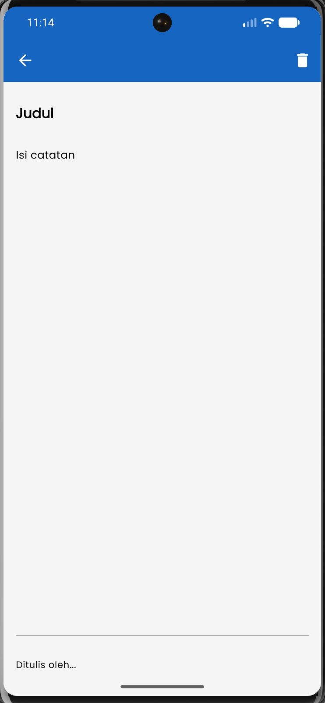
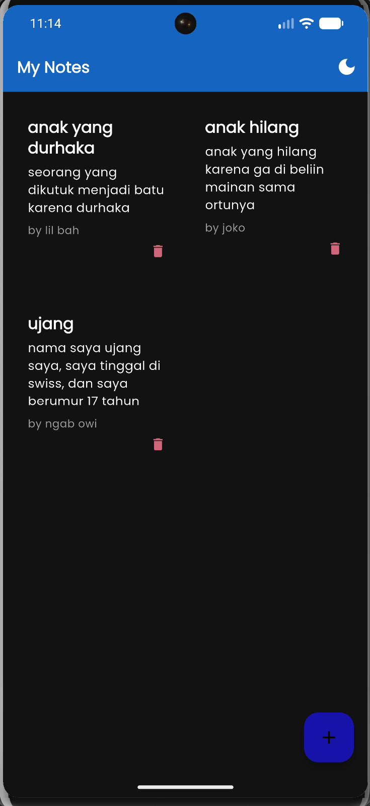
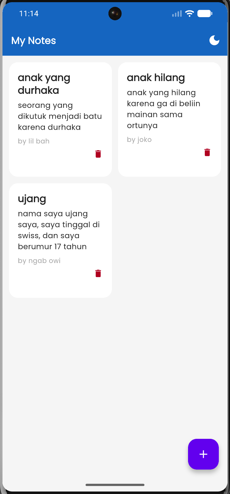

  
  &nbsp;&nbsp;
  
  &nbsp;&nbsp;
  

-------------------------------------------------------------------------------------------------------------------------------------------------------------------------------------------

📝 Note App Flutter

Aplikasi Note App sederhana yang dibuat menggunakan Flutter dan database lokal SQLite.
Aplikasi ini mendukung ✨ Dark Mode & Light Mode, fitur ➕ tambah catatan, ✏️ edit/menimpa catatan, serta 🗑️ hapus catatan.

📸 Preview Aplikasi
🌙 Dark Mode
☀️ Light Mode
✨ Fitur Utama
📝 Menambahkan catatan baru
✏️ Mengedit / menimpa catatan
🗑️ Menghapus catatan
🌙 Dark Mode
☀️ Light Mode
💾 Penyimpanan data lokal menggunakan SQLite
📱 UI sederhana dan responsif
⚡ Penyimpanan otomatis saat kembali halaman

🛠️ Teknologi Yang Digunakan
Teknologi	Keterangan
Flutter	Framework utama aplikasi
Dart	Bahasa pemrograman
SQLite	Database lokal
sqflite	Package SQLite Flutter
provider / setState	State management sederhana

📂 Struktur Folder
lib/
│
├── models/
│   └── note_model.dart
│
├── pages/
│   ├── home_page.dart
│   └── note_page.dart
│
├── services/
│   └── database_helper.dart
│
├── widgets/
│   └── note_card.dart
│
└── main.dart

⚙️ Instalasi Project
1️⃣ Clone Repository
git clone https://github.com/username/note_app_flutter.git
2️⃣ Masuk Folder Project
cd note_app_flutter
3️⃣ Install Dependency
flutter pub get
4️⃣ Jalankan Aplikasi
flutter run
📦 Dependency

Tambahkan dependency berikut pada file pubspec.yaml

dependencies:
  flutter:
    sdk: flutter

  sqflite: ^2.3.0
  path: ^1.9.0
🗃️ Database SQLite

Aplikasi menggunakan SQLite untuk menyimpan data catatan secara lokal.

Struktur Table
Column	Type
id	INTEGER
title	TEXT
content	TEXT
author	TEXT
createdAt	TEXT
updatedAt	TEXT
🌗 Dark Mode & Light Mode

Aplikasi mendukung perubahan tema:

🌙 Dark Theme
☀️ Light Theme

Pengguna dapat mengganti tema langsung dari halaman utama menggunakan tombol icon bulan.

🧠 Cara Kerja Aplikasi
➕ Menambah Catatan

Pengguna dapat membuat catatan baru dengan mengisi:

Judul
Isi catatan
Penulis
✏️ Edit / Menimpa Catatan

Jika catatan dipilih kembali:

Data lama akan muncul
Pengguna bisa mengubah isi
Data lama akan diperbarui
🗑️ Menghapus Catatan

Catatan dapat dihapus menggunakan tombol icon delete.

📱 Tampilan UI
Home Page
Menampilkan daftar catatan
Grid view card
Tombol tambah catatan
Toggle dark mode
Note Page
Form input judul
Form isi catatan
Input penulis
Tombol save & delete
🚀 Future Improvement
🔍 Search note
📌 Pin note
🖼️ Upload image
☁️ Cloud sync
🔐 Login authentication
🏷️ Category note
